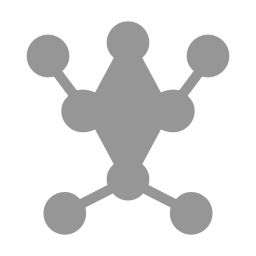

<p align="center">
  
</p>

<h1 align="center">MeshApp</h1>

<p align="center">
  Кросс-платформенный десктопный клиент для mesh-сети
  <a href="https://meshtastic.org">Meshtastic</a>
  <br/>
  <b>Java 21 &nbsp;·&nbsp; JavaFX &nbsp;·&nbsp; Protobuf &nbsp;·&nbsp; LoRa</b>
</p>

<p align="center">
  
  
  
  
</p>

---

## О проекте

**MeshApp** — полнофункциональный десктопный клиент для управления устройствами и общения в mesh-сети [Meshtastic](https://meshtastic.org). Приложение заменяет мобильные клиенты на ПК и предоставляет расширенные возможности мониторинга, визуализации телеметрии и настройки радиомодулей.

Meshtastic — открытый проект, превращающий недорогие LoRa-модули в узлы децентрализованной mesh-сети. Сообщения передаются на расстояние от сотен метров до десятков километров — без интернета, вышек сотовой связи и какой-либо инфраструктуры.

```
                        ┌──────────────────────────────────────────────┐
                        │                  MeshApp                     │
                        │                                              │
  ┌────────┐    TCP     │  ┌──────────┐  ┌─────────┐  ┌────────────┐  │
  │  LoRa  │◄──────────►│  │ Protocol │─►│  Model  │─►│     UI     │  │
  │ Device │    USB     │  │ Handler  │  │  State  │  │   (JavaFX) │  │
  └────────┘◄──────────►│  └──────────┘  └─────────┘  └────────────┘  │
                        │                                              │
                        └──────────────────────────────────────────────┘
```

---

## Возможности

### Чат и обмен сообщениями

```
┌─ Каналы ──────────────────────────────────────────────────────┐
│                                                               │
│  # LongFast          ┌───────────────────────────────────┐    │
│  # Emergency     ◄───┤  Привет, mesh!           12:34    │    │
│  # GPS-Track         │                                   │    │
│                      │         Принято! Вижу тебя  ►     │    │
│  Личные сообщения    │         на 3 хопа   12:35         │    │
│  ├─ Node-ABCD        │                                   │    │
│  └─ Node-EF01        │  ┌─ Ответ на: "Привет, mesh!" ─┐ │    │
│                      │  │  Тест связи        12:36     │ │    │
│                      │  └──────────────────────────────┘ │    │
│                      │                                   │    │
│                      │  [  Написать сообщение...    ] 📎 │    │
│                      └───────────────────────────────────┘    │
└───────────────────────────────────────────────────────────────┘
```

- **Многоканальный чат** — отправка и приём сообщений в нескольких mesh-каналах
- **Личные сообщения** — приватная переписка с отдельными узлами
- **Ответы на сообщения** — цитирование с контекстом
- **Статусы доставки** — ACK/NAK отслеживание отправленных сообщений
- **Traceroute** — визуализация маршрута до любого узла сети
- **Запрос NodeInfo** — получение актуальных данных об узле по запросу
- **Эмодзи** — встроенный выбор эмодзи
- **Счётчик непрочитанных** — бейджи на каждом чате
- **История** — полная история сообщений с поиском, хранится в локальной БД

---

### Узлы сети

```
┌─ Узлы ────────────────────────────────────────────────────────┐
│  🔍 [ Поиск узлов...                              ]          │
│                                                               │
│  ┌─────────┬──────────────┬────────┬─────────┬──────────────┐ │
│  │  Имя    │  ID          │  Hops  │  SNR    │  Был в сети  │ │
│  ├─────────┼──────────────┼────────┼─────────┼──────────────┤ │
│  │  Base   │  !abcd1234   │  0     │  12.5   │  1 мин назад │ │
│  │  Relay  │  !ef567890   │  1     │   8.0   │  5 мин назад │ │
│  │  Mobile │  !11223344   │  3     │   2.5   │  1 час назад │ │
│  └─────────┴──────────────┴────────┴─────────┴──────────────┘ │
│                                                               │
│  ┌─ Детали: Base ────────────────────┐                        │
│  │  Роль:        CLIENT              │                        │
│  │  Железо:      HELTEC_V3           │                        │
│  │  Координаты:  55.7558°, 37.6173°  │                        │
│  │  Батарея:     87%  ████████▓░     │                        │
│  │  Напряжение:  4.02V               │                        │
│  │  Ch Util:     12.3%               │                        │
│  └───────────────────────────────────┘                        │
└───────────────────────────────────────────────────────────────┘
```

- **Список узлов** с сортировкой по дистанции (хопы) и имени
- **Поиск** по имени, короткому имени, ID или числовому адресу
- **Детальная информация** — железо, роль, координаты, прошивка, SNR/RSSI
- **Кэширование узлов** — локальная база с пагинацией

---

### Телеметрия и мониторинг

```
┌─ Телеметрия ──────────────────────────────────────────────────┐
│                                                               │
│  Период: [ 1ч | 6ч | 12ч | 24ч | 48ч | 1нед | Всё ]        │
│                                                               │
│  Батарея (%)                  Ch Utilization (%)              │
│  100│ ▄▄▄▄                    25│                             │
│   90│▀    ▀▀▄▄▄                 │    ▄▄                       │
│   80│         ▀▀▄▄▄          15│▄▄▀▀  ▀▄▄    ▄▄             │
│   70│              ▀▀▄         │         ▀▀▄▄▀  ▀▄           │
│   60│                        5│                  ▀▄          │
│     └─────────────────         └──────────────────            │
│      06:00    12:00  18:00      06:00    12:00  18:00         │
│                                                               │
│  Напряжение (V)               Air Util TX (%)                │
│  4.2│▀▀▀▄▄                   10│                              │
│  3.8│     ▀▀▄▄▄                │   ▄  ▄                      │
│  3.4│          ▀▀            5│▄▀ ▀▀▀ ▀▄▄▄                  │
│  3.0│                          │           ▀▀▄               │
│     └─────────────────         └──────────────────            │
│      06:00    12:00  18:00      06:00    12:00  18:00         │
│                                                               │
└───────────────────────────────────────────────────────────────┘
```

- **Графики в реальном времени** — батарея, напряжение, загрузка канала, Air Util TX
- **Фильтрация по периодам** — от 1 часа до всей истории
- **Агрегация данных** — автоматическое усреднение для плавных кривых
- **Таблица телеметрии** — детализированные записи с временными метками

---

### Подключения

```
┌─ Подключения ─────────────────────────────────────────────────┐
│                                                               │
│  ┌───────────────────────┐  ┌───────────────────────┐         │
│  │  📡  Base Station     │  │  📡  Portable Node    │         │
│  │  TCP  192.168.1.100   │  │  USB  /dev/ttyUSB0    │         │
│  │  Порт: 4403           │  │                       │         │
│  │  ● Подключено         │  │  ○ Отключено          │         │
│  │  [ Отключить ]        │  │  [ Подключить ]       │         │
│  └───────────────────────┘  └───────────────────────┘         │
│                                                               │
│                      [ + Новое подключение ]                  │
└───────────────────────────────────────────────────────────────┘
```

- **TCP и Serial** — подключение по сети или USB
- **Несколько устройств** — одновременная работа с несколькими радиомодулями
- **Профили подключений** — сохранение и быстрое переключение
- **Автообмен конфигурацией** — автоматическое получение параметров устройства при подключении

---

### Конфигурация устройства

- **Редактирование параметров** — полное управление настройками LoRa-модуля через древовидный интерфейс
- **Имя узла** — установка Long Name (40 символов) и Short Name (4 символа)
- **Атомарное сохранение** — транзакционный механизм begin/commit для групповых изменений
- **Все модули** — настройка Device, LoRa, Position, Power, Network, Bluetooth, Display и других модулей

---

### Интерфейс

```
┌──────────────────────────────────────────────────────────────────┐
│  ● ● ●                     MeshApp                               │
├────────┬─────────────────────────────────────────────────────────┤
│        │                                                         │
│  💬    │                                                         │
│  Чат   │              [ Активная форма ]                         │
│        │                                                         │
│  📡    │                                                         │
│  Узлы  │                                                         │
│        │                                                         │
│  📊    │                                                         │
│  Обзор │                                                         │
│        │                                                         │
│  🔌    │                                                         │
│  Связь │                                                         │
│        │                                                         │
│  ⚙     │                                                         │
│  Настр │                                                         │
│        │                                                         │
│  📋    │                                                         │
│  Логи  │                                                         │
│        │                                                         │
├────────┴─────────────────────────────────────────────────────────┤
│  MeshApp v1.0.0                         ██████░░ 156 MB / 256 MB │
└──────────────────────────────────────────────────────────────────┘
```

- **Тёмная и светлая тема** — AtlantaFX Cupertino
- **Нативное оформление окна** — эффект Mica (Windows 11), vibrancy (macOS)
- **Кастомный titlebar** — кнопки управления окном в стиле платформы
- **Боковая панель** — быстрая навигация между разделами
- **Toast-уведомления** — информирование о событиях без отрыва от работы
- **Встроенные логи** — просмотр отладочной информации с цветовой кодировкой по уровню

---

## Быстрый старт

### Требования

- **JDK 21+** (скачивается автоматически через Gradle Toolchain)
- **Git** для клонирования репозитория

### Сборка и запуск

```bash
# Клонировать репозиторий
git clone https://github.com/<your-org>/meshapp.git
cd meshapp

# Запустить приложение
./gradlew run

# Собрать нативный инсталлятор (.dmg / .msi / .deb)
./gradlew jpackage
```

### Подключение к устройству

1. Подключите Meshtastic-устройство по USB или убедитесь, что оно доступно по TCP
2. В разделе **Подключения** добавьте новое подключение (IP:порт или COM-порт)
3. Нажмите **Подключить** — MeshApp автоматически обменяется конфигурацией с устройством
4. Переключитесь в **Чат** для обмена сообщениями или в **Узлы** для мониторинга сети

---

## Технологии

```
┌─────────────────────────────────────────────────────────┐
│                      MeshApp                            │
├──────────────┬──────────────────┬───────────────────────┤
│   Интерфейс  │     Данные       │     Связь             │
├──────────────┼──────────────────┼───────────────────────┤
│  JavaFX 21   │  Protobuf 4.33   │  TCP Sockets          │
│  AtlantaFX   │  H2 Database     │  jSerialComm (USB)    │
│  MigLayout   │  Gson            │  Meshtastic Proto     │
│  JNA         │  SLF4J/Logback   │  LoRa (через модуль)  │
└──────────────┴──────────────────┴───────────────────────┘
```

| Компонент | Технология | Назначение |
|-----------|-----------|------------|
| UI | JavaFX 21 + AtlantaFX | Интерфейс с нативным оформлением |
| Протокол | Protobuf 4.33 | Сериализация mesh-пакетов |
| База данных | H2 (embedded) | Локальное хранение сообщений и телеметрии |
| Serial | jSerialComm | USB-подключение к устройствам |
| Нативные эффекты | JNA | Mica (Win), vibrancy (macOS) |
| Сборка | Gradle 8.13 | Компиляция, jpackage-инсталляторы |

---

## Структура проекта

```
meshapp/
├── src/main/java/com/meshtastic/client/
│   ├── MeshApp.java              # Точка входа (JavaFX Application)
│   ├── connection/               # Транспортный слой (TCP, Serial)
│   ├── protocol/                 # Разбор Meshtastic-протокола
│   ├── model/                    # Модели данных (потокобезопасные)
│   ├── service/                  # Бизнес-логика и хранение
│   ├── forms/                    # Экраны приложения
│   ├── components/               # Переиспользуемые UI-компоненты
│   ├── system/                   # Каркас приложения (FormManager, RootPane)
│   ├── platform/                 # Платформозависимый код (Win/Mac/Linux)
│   └── themes/                   # Управление темами
├── src/main/proto/meshtastic/    # Protobuf-схемы Meshtastic
├── src/main/resources/           # CSS, шрифты, иконки, логотипы
└── build.gradle                  # Конфигурация сборки
```

---

## Сборка инсталляторов

MeshApp собирается в нативные пакеты через `jpackage`:

| Платформа | Формат | Команда |
|-----------|--------|---------|
| Windows | `.msi` | `./gradlew jpackage` |
| macOS | `.dmg` | `./gradlew jpackage` |
| Linux | `.deb` | `./gradlew jpackage` |

---

## Лицензия

Распространяется под лицензией [GPL-3.0](LICENSE).

---

<p align="center">
  Создано для сообщества <a href="https://meshtastic.org">Meshtastic</a>
</p>
