<p align="center">
  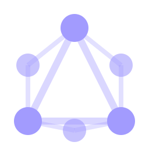
</p>

<h1 align="center">MeshApp</h1>

<p align="center">
  Кросс-платформенный десктопный клиент для mesh-сети
  <a href="https://meshtastic.org">Meshtastic</a> и MeshCore
  <br/>
  <b>Java 25 &nbsp;·&nbsp; JavaFX &nbsp;·&nbsp; Protobuf &nbsp;·&nbsp; LoRa</b>
</p>

<p align="center">
  
  
  
  
  <a href="https://t.me/+SRaOd1gftoo5MWRi">
  
</a>
</p>

<p align="center">
  Основная платформа разработки:
  <a href="https://git.privatepractice.app/covox/meshapp">git.privatepractice.app/covox/meshapp</a>
</p>

<div align="right">

<strong>Русский</strong> | <a href="README.md">English</a>

</div>

---


## О проекте

**MeshApp** — полнофункциональный кроссплатформенный десктопный клиент для [Meshtastic](https://meshtastic.org) и MeshCore, работающий по **TCP**, **Serial / USB** и **BLE**. Приложение предназначено для управления устройствами, обмена сообщениями, мониторинга сети и редактирования конфигурации радиомодулей с ПК на Windows, macOS и Linux.

Кодовая база поддерживает несколько коммуникационных протоколов: транспортный слой отделён от протокольного runtime-а. Сейчас реализованы **Meshtastic**, runtime **MeshCore KISS** поверх TCP/Serial byte stream и runtime **MeshCore Companion Protocol** для BLE и raw TCP/Serial byte stream; новые подключения по умолчанию используют Meshtastic, а MeshCore выбирается явно в форме подключения.

Meshtastic — открытый проект, превращающий недорогие LoRa-модули в узлы децентрализованной mesh-сети. Сообщения передаются на расстояние от сотен метров до десятков километров — без интернета, вышек сотовой связи и какой-либо инфраструктуры.

MeshCore — лёгкий mesh-протокол для LoRa и других packet-radio устройств. В MeshApp поддержаны режим **MeshCore KISS modem** для TCP/Serial и **MeshCore Companion Protocol** для BLE, TCP и Serial endpoint-ов, которые передают raw Companion packets.

```
                     +------------------------------------------------------+
                     |                       MeshApp                         |
                     |                                                      |
 TCP (IP:4403) ----->|  +----------------+  +----------------+ +---------+ |
 USB Serial -------->|  |   Transport    |->| Protocol       | | UI /    | |
 BLE / GATT -------->|  | TCP/Serial/BLE |  | Runtime        | | Forms   | |
                     |  +----------------+  | Meshtastic /   | +---------+ |
                     |                      | MeshCore        |             |
                     |           |          +----------------+      |       |
                     |           v                  |               v       |
                     |   Native serial / BLE        v            H2 / Logs  |
                     |                         DeviceState / services       |
                     +------------------------------------------------------+
```

---

## Новые возможности

- **Архитектура под несколько протоколов** — транспортный слой (`TCP`, `Serial`, `BLE`) отделён от протокольных адаптеров; Meshtastic, MeshCore KISS и MeshCore Companion вынесены в отдельные runtime-ы
- **Явный выбор протокола** — новые подключения по умолчанию используют Meshtastic; MeshCore KISS и MeshCore Companion выбираются в профиле подключения
- **MeshCore Companion в основных экранах** — «Чаты», «Ноды», личные сообщения, «Телеметрия», «Настройки» и «LoRa пакеты» используют общий `DeviceState` bridge для MeshCore Companion Protocol
- **Автоподключение профилей** — выбранные подключения автоматически устанавливаются при запуске приложения
- **Карты и история трейсов** — сохранённые traceroute-результаты доступны во вкладке ноды и могут быть показаны на карте
- **MeshApp IDE** — Lua-скрипты, магазин скриптов, импорт/экспорт, автозапуск, KV-хранилище, редактор и отладчик встроены в приложение
- **Команды в поле ввода** — `@tracebot` и `@infobot` с автодополнением по нодам для быстрого `Traceroute` и запроса `NodeInfo`
- **Оповещения по чатам** — mute/unmute отдельно для каждого канала и личного диалога, с сохранением настройки локально
- **Crash / problem reporting** — предложение отправить лог после аварийного завершения и ручная отправка отчёта из окна помощи
- **Мониторинг LoRa-пакетов** — отдельное окно live-захвата с фильтрами по направлению, типу, диапазону даты/времени, поиском, HEX / ASCII предпросмотром и экспортом в JSON/CSV
- **Синхронизация времени с ПК** — установка текущего времени на радио с обновлением GMT при необходимости
- **Очистка локальной БД** — полный сброс сообщений, реакций, кэша нод, телеметрии и журнала LoRa-пакетов из интерфейса
- **Расширенный редактор конфигурации** — человекочитаемый ввод IPv4, node ID, hex-значений и bitmask-полей, плюс поэлементное редактирование repeated-полей

---

## Возможности

### Chat и обмен сообщениями

<p align="center">
  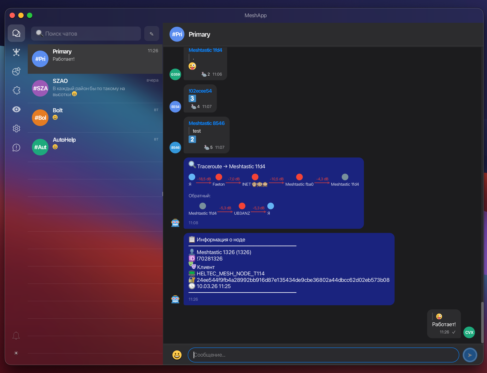
  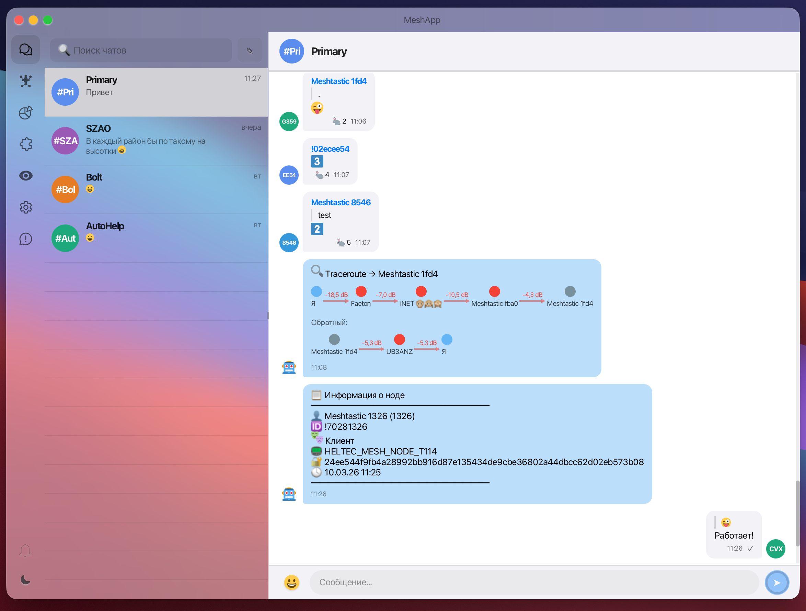
</p>

- **Многоканальный чат** — отправка и приём сообщений в нескольких mesh-каналах
- **Личные сообщения** — приватная переписка с отдельными узлами
- **Ответы на сообщения** — цитирование с контекстом
- **Реакции на сообщения** — быстрые emoji-реакции с сохранением и отслеживанием статуса доставки
- **Статусы доставки** — ACK/NAK отслеживание отправленных сообщений
- **Traceroute** — визуализация маршрута до узлов сети и сохранение успешных результатов
- **Запрос NodeInfo** — получение актуальных данных об узле по запросу
- **Команды `@tracebot` и `@infobot`** — запуск traceroute и запроса информации прямо из строки ввода с подсказками по имени и `!nodeid`
- **Управление каналами** — создание secondary-каналов и редактирование имени, PSK, uplink/downlink и точности публикации позиции
- **Emoji** — встроенный выбор эмодзи
- **Счётчик непрочитанных** — бейджи на каждом чате
- **Оповещения по чатам** — включение и отключение уведомлений отдельно для каждого канала и DM через иконку звонка и контекстное меню
- **История** — полная история сообщений с поиском, хранится в локальной БД
- **Локальная очистка истории** — удаление отдельных сообщений и целых чатов из встроенной базы

---

### Узлы сети

<p align="center">
  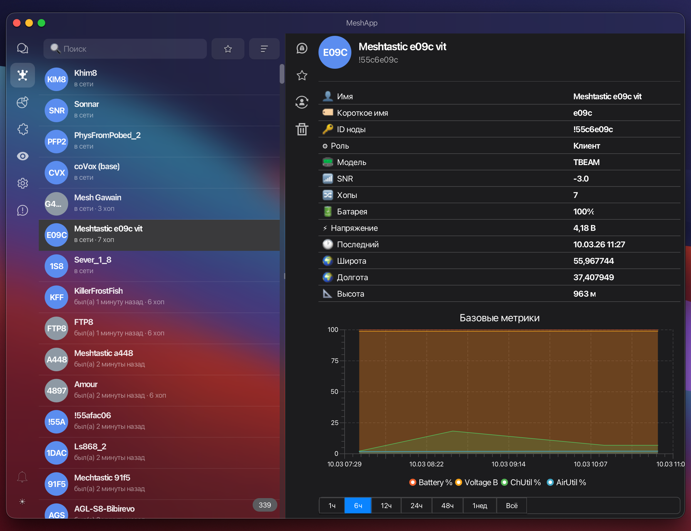
  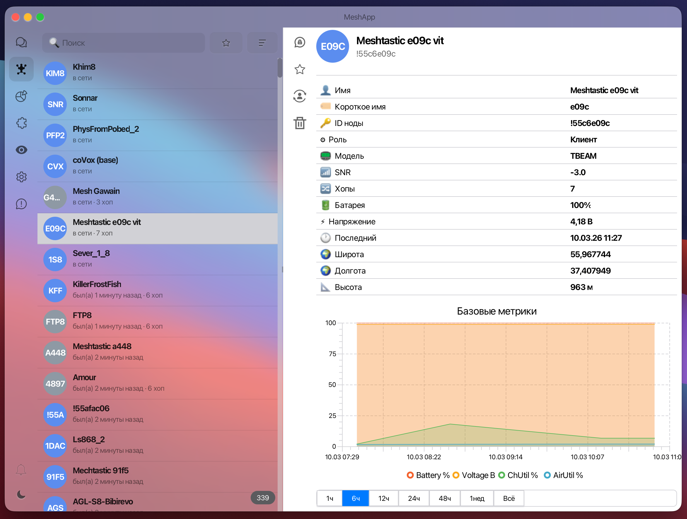
</p>

- **Гибкая сортировка и фильтры** — последний отклик, дистанция, SNR, хопы, канал, избранные, игнорируемые, прямые и офлайн-ноды
- **Поиск** по имени, короткому имени, ID или числовому адресу
- **Детальная карточка узла** — железо, роль, координаты, прошивка, SNR/RSSI и график телеметрии
- **Быстрые действия** — открыть приватный чат, запустить traceroute, запросить свежий NodeInfo, удалить узел из локального списка
- **Вкладка «Трейсы»** — история traceroute по выбранной ноде с датой создания, фильтром по дате и динамической подгрузкой при прокрутке
- **Переход на карту из трейса** — каждый сохранённый трейс можно открыть на форме карты через иконку карты
- **Избранные и игнорируемые узлы** — локальное хранение и синхронизация статуса с устройством
- **Кэширование узлов** — локальная база с пагинацией

---

### Карты

- **OSM-карта нод** — отображение текущих и кэшированных нод с координатами
- **Онлайн и оффлайн тайлы** — работа с сетевыми OSM-тайлами, локальным кэшем и выбранным каталогом `z/x/y.png|jpg|jpeg`
- **Поиск и фильтры** — поиск по нодам, фильтры неизвестных, офлайн, избранных, прямых и игнорируемых нод
- **Навигация** — переход к своей ноде, автообзор всех нод с координатами, масштабирование и ночной режим карты
- **Измерения** — измерение расстояния между точками и выделение прямоугольной области
- **Загрузка области** — скачивание тайлов выделенной области с прогрессом, паузой и отменой
- **Визуализация трейсов** — выбор последних сохранённых traceroute-результатов и наложение одного или нескольких маршрутов на карту

---

### Телеметрия и мониторинг

<p align="center">
  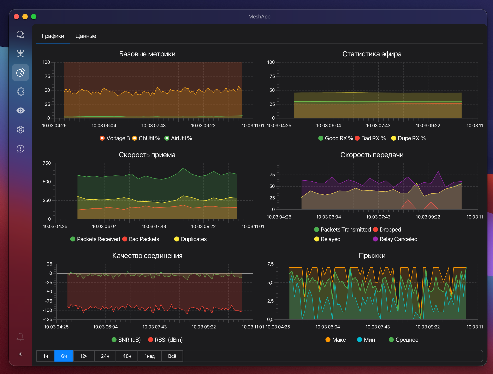
  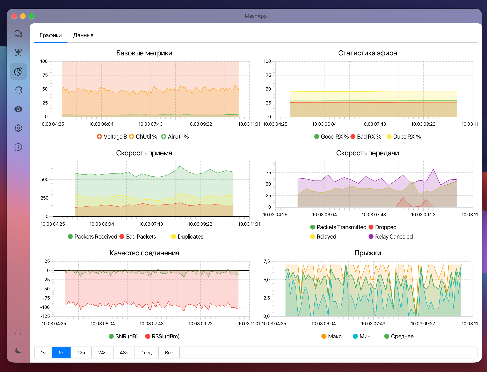
</p>

- **Дашборд устройства** — отдельный экран со вкладками «Графики» и «Данные»
- **Графики в реальном времени** — батарея, напряжение, загрузка канала, Air Util TX
- **Фильтрация по периодам** — от 1 часа до всей истории
- **Агрегация данных** — автоматическое усреднение для плавных кривых
- **Таблица телеметрии** — детализированные записи с временными метками
- **Расширенные метрики** — Good RX, Bad RX, Dupe RX, TX, Dropped, Relayed, RSSI, SNR и hop-данные
- **Ленивая подгрузка журнала** — догрузка длинной истории при прокрутке

---

### Подключения

<p align="center">
  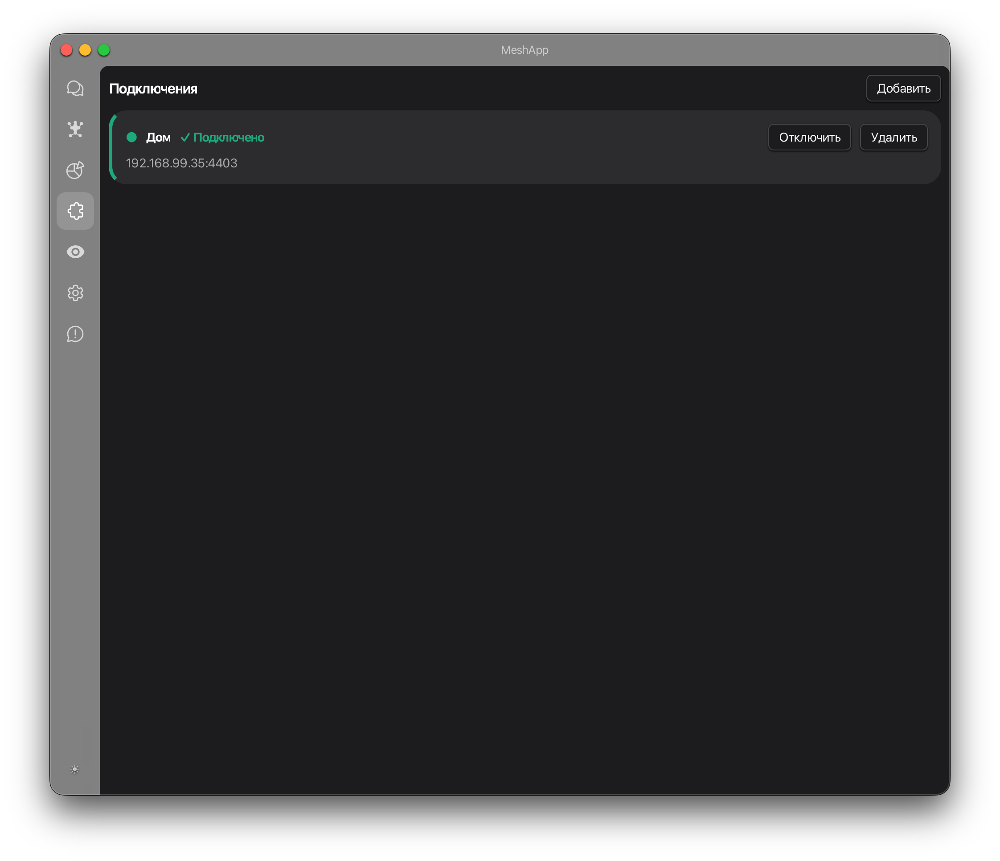
  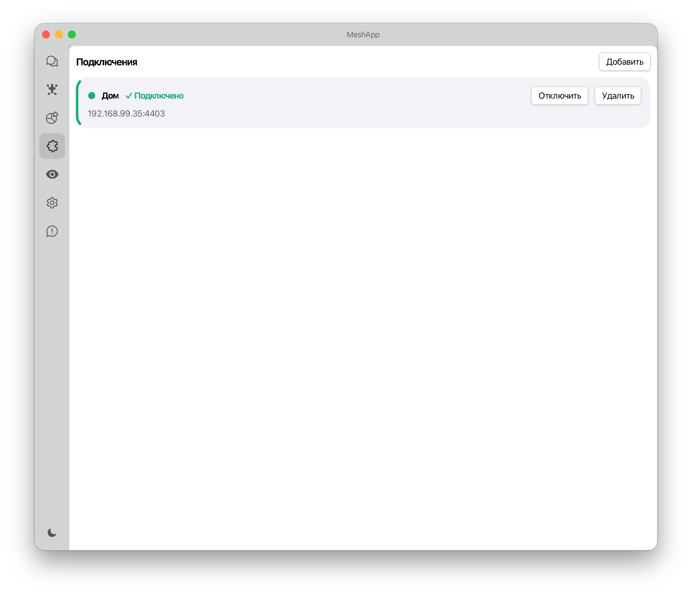
</p>

- **TCP, Serial / USB и BLE** — подключение по сети, через COM/tty-порт или Bluetooth LE
- **Отдельные transport и protocol слои** — подключение открывает низкоуровневый transport и запускает runtime выбранного в профиле протокола
- **Поиск устройств** — автопоиск serial-портов и BLE-сканирование Meshtastic/MeshCore-устройств
- **Профили подключений** — сохранение адресов, портов и BLE-устройств для быстрого повторного подключения
- **Автоподключение** — флаг профиля, который запускает подключение автоматически при старте приложения; по умолчанию выключен
- **Одно активное подключение** — в каждый момент времени приложение работает с одним выбранным устройством
- **BLE-сопряжение** — passkey/pairing flow, когда этого требует устройство или платформа
- **Автообмен конфигурацией** — автоматическое получение параметров устройства при подключении
- **Автопереподключение** — повторные попытки восстановления соединения после разрыва
- **Настройка DTR/RTS для Serial** — выбор режима modem lines для USB-UART адаптеров
- **Надёжный Serial для USB-UART мостов** — корректная работа с CH340/CP210x/FTDI, чтобы не провоцировать лишний reset ESP32; отдельная совместимость для Windows + Silicon Labs / CP210x

#### MeshCore

Текущая MeshCore-интеграция в MeshApp поддерживает **MeshCore KISS modem protocol** поверх **Serial / USB** или **TCP**, а также **MeshCore Companion Protocol** поверх **BLE**, **TCP** и **Serial**. Для новых профилей по умолчанию выбран Meshtastic; для MeshCore нужно явно выбрать `MeshCore KISS` или `MeshCore Companion` в поле протокола.

MeshCore Companion не использует KISS framing. Для BLE используется service `6E400001-B5A3-F393-E0A9-E50E24DCCA9E`, RX characteristic `6E400002-B5A3-F393-E0A9-E50E24DCCA9E` и TX notifications `6E400003-B5A3-F393-E0A9-E50E24DCCA9E`. Для TCP/Serial поддерживаются endpoint-ы, которые передают raw Companion packets без KISS-обёртки.

Что уже поддерживается:

- стандартное KISS-фреймирование (`FEND`, `FESC`, escape-последовательности) для TCP/Serial byte stream
- явный выбор `MESHCORE_KISS` в форме подключения
- чтение базовых metadata через MeshCore `SetHardware`: имя устройства, версия, identity, radio parameters, TX power, battery, stats, RSSI/SNR metadata и TX status
- BLE-профиль MeshCore Companion с отдельными RX/TX UUID, подпиской на TX notifications и `APP_START` handshake
- `FrameFormat.MESHCORE_COMPANION` для TCP/Serial raw Companion packets
- чтение Companion metadata: self-info, public key, имя устройства, device info и battery/storage packet
- синхронизация MeshCore contacts и channel info в общий список Nodes/Chat
- входящие channel messages и DM из очереди Companion Protocol
- отправка channel messages и DM через MeshCore Companion Protocol
- read-only MeshCore metadata в Settings
- raw MeshCore Companion packets в разделе «LoRa пакеты»
- отображение фактически выбранного протокола в карточке подключения

Текущие ограничения:

- MeshCore KISS поддерживается только для TCP/Serial; MeshCore Companion по TCP/Serial требует endpoint, который действительно отдаёт raw Companion packets
- MeshCore KISS остаётся modem/metadata-интеграцией; application workflow реализован через MeshCore Companion Protocol
- для MeshCore Companion недоступны Meshtastic-only функции: Admin protobuf save-flow, reactions, traceroute и Meshtastic bot-команды

Подробности вынесены в [docs/meshcore-support.ru.md](docs/meshcore-support.ru.md).

---

### Конфигурация устройства

<p align="center">
  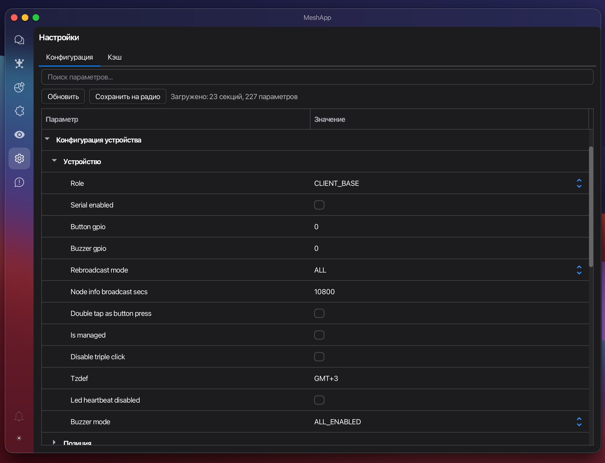
  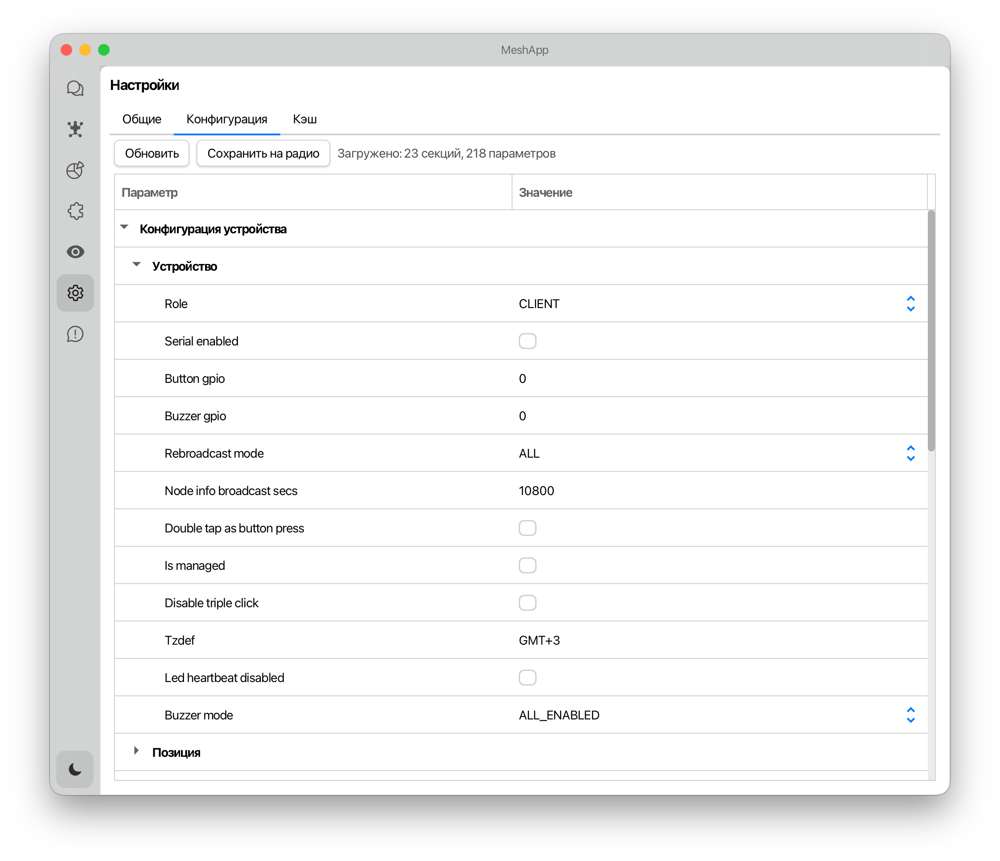
</p>

- **Редактирование параметров** — полное управление настройками LoRa-модуля через древовидный интерфейс
- **Имя узла** — установка Long Name (40 символов) и Short Name (4 символа)
- **Атомарное сохранение** — транзакционный механизм begin/commit для групповых изменений
- **Все модули** — настройка Device, LoRa, Position, Power, Network, Bluetooth, Display и других модулей
- **Человекочитаемые редакторы полей** — IPv4-адреса, node ID, hex-значения и bitmask-поля редактируются без ручного пересчёта protobuf-значений
- **Repeated-поля как отдельные слоты** — списки вроде `admin_key` и `ignore_incoming` можно добавлять, удалять и править поэлементно
- **Синхронизация времени с ПК** — установка времени на ноде из системных часов компьютера с обновлением GMT и повторной синхронизацией после переподключения, если нужен reboot
- **Snapshot-файлы конфигурации** — экспорт и импорт полной конфигурации в формате `.mcf`
- **Шаблоны конфигурации** — экспорт и импорт обезличенных шаблонов `.mtp` без персональных и секретных полей
- **Очистка локальной базы данных** — полный сброс встроенной H2-базы с удалением сообщений, реакций, телеметрии, кэша нод и журнала пакетов
- **Управление питанием устройства** — перезапуск и выключение оборудования из интерфейса

---

### Диагностика и логирование

<p align="center">
  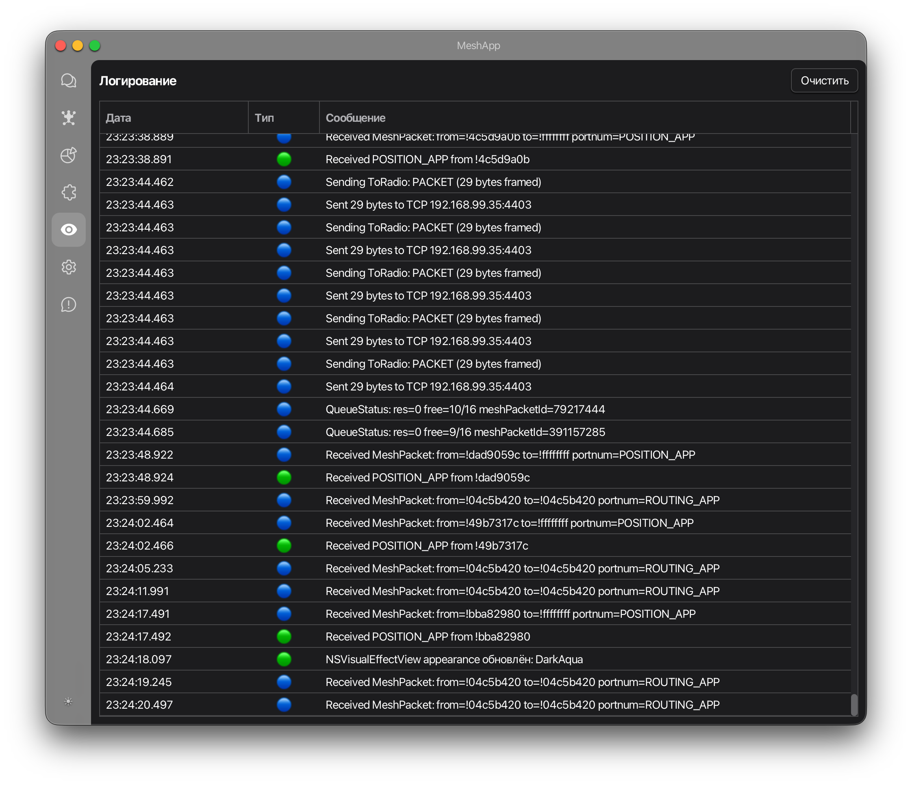
  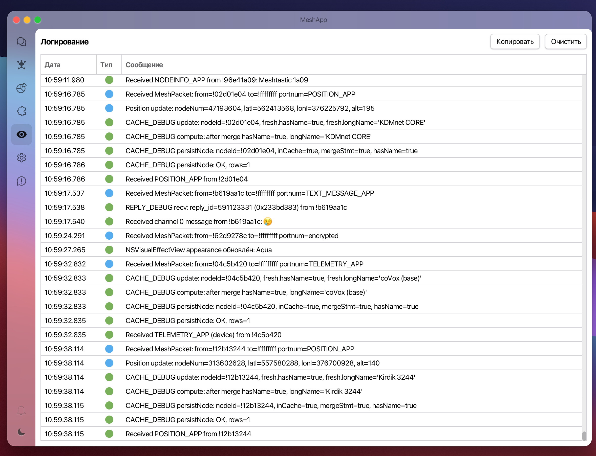
</p>

- **Встроенные логи** — просмотр отладочной информации с цветовой кодировкой по уровню
- **Управление логами** — пауза/возобновление автопрокрутки, копирование, очистка и экспорт в `.log`
- **Мониторинг LoRa-пакетов** — отдельное окно live-захвата входящих и исходящих mesh-пакетов
- **Управление захватом** — запуск, остановка и полная очистка накопленного журнала пакетов
- **Фильтры и поиск** — отбор по направлению, типу, диапазону даты/времени, узлам и payload, плюс пагинация для длинных журналов
- **HEX / ASCII и дерево пакета** — просмотр сырых байт, protobuf-структуры и подсветка выбранных полей
- **Экспорт пакетов** — копирование и сохранение выбранного пакета в текстовом виде или protobuf-style JSON, а также экспорт всего отфильтрованного набора в JSON или CSV
- **Отчёты о сбоях и проблемах** — отправка технического лога разработчикам после crash или вручную из окна «Помощь»

#### LoRa Debug

<p align="center">
  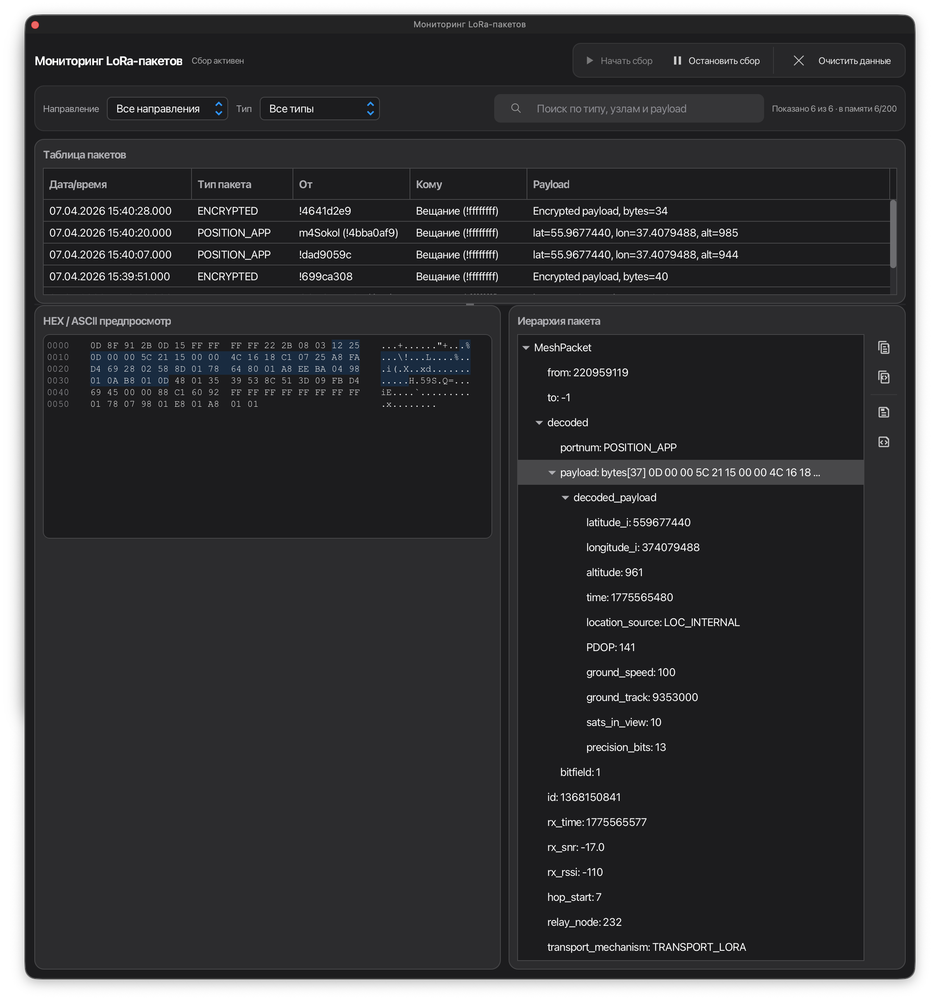
  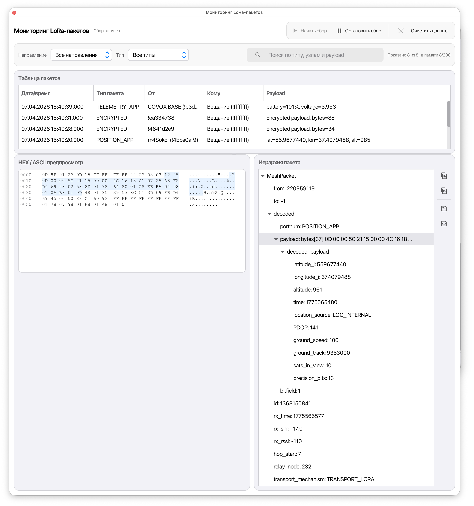
</p>

`LoRa Debug` помогает разбирать реальный mesh-трафик на уровне отдельных пакетов. Окно показывает входящие, исходящие и внутренние `MeshPacket`, позволяет быстро отфильтровать журнал по направлению, типу сообщения и содержимому, а выбранный тип фильтра сохраняется при обновлении списка доступных типов.

Инструмент полезен для диагностики доставки сообщений, проверки `NodeInfo` / `Telemetry` / `Position` пакетов, анализа `MQTT proxy` трафика и просмотра сырых protobuf-данных через HEX / ASCII предпросмотр и дерево структуры пакета. Для больших журналов используется динамическая подгрузка страниц, а экспорт JSON/CSV выполняется пачками с индикатором прогресса.

---

### MeshApp IDE и Lua-скрипты

- **Список скриптов** — карточки с именем, emoji-иконкой, автором, версией, типом, статусом запуска и временем последнего изменения без вывода внутреннего ID
- **Настройки скрипта** — имя, автор, описание, иконка, автозапуск, тип бота и привязка к ноде или имени автоматизации
- **Версионирование кода** — версия повышается только при изменении Lua-кода; изменение настроек не увеличивает версию
- **Эфирные и automation-боты** — скрипты могут слушать чат через `on_message` или запускаться командой из поля ввода через `on_command`
- **Автозапуск скриптов** — скрипты с включённым автозапуском стартуют для выбранной ноды после готовности подключения
- **Редактор Lua** — отдельное окно с подсветкой синтаксиса, нумерацией строк, автоотступами и автодополнением `mesh.*`
- **Отладчик** — breakpoints, запуск в debug-режиме, продолжение, пошаговое выполнение и просмотр локальных/global переменных
- **KV-хранилище** — изолированное key-value хранилище каждого скрипта с отдельным редактором
- **Импорт и экспорт** — перенос скриптов в JSON-файлах `.meshapp-script.json` вместе с метаданными
- **Магазин скриптов** — загрузка каталога из MeshApp Store, фильтр по типу, отображение автора, установка, обновление и удаление локальных копий
- **Документация API** — встроенный sandbox API описан в отдельном документе с краткой справкой по Lua и примерами

---

### Интерфейс

- **Тёмная и светлая тема** — AtlantaFX Cupertino
- **Нативное оформление окна** — эффект Mica (Windows 11), vibrancy (macOS)
- **Кастомный titlebar** — кнопки управления окном в стиле платформы
- **Боковая панель** — быстрая навигация между разделами
- **Системный трей / status item** — сворачивание в трей, восстановление окна и выход из приложения
- **Системные уведомления** — нативные OS-уведомления для входящих сообщений с подавлением при активном открытом чате
- **Переключатели в боковой панели** — быстрое переключение темы и уведомлений без захода в настройки
- **Проверка обновлений** — опциональная проверка новой версии при запуске
- **Настройки приложения** — отключение визуальных эффектов, программный рендеринг и выбор режима минимизации в трей
- **Запоминание состояния окна** — восстановление размера, позиции, развёрнутого состояния и сплиттеров между сессиями
- **Toast-уведомления** — информирование о событиях без отрыва от работы
- **Терминальный режим** — TUI-клиент на Lanterna для подключения и работы с чатами без JavaFX-интерфейса

---

### Кэш и интеграции

- **Импорт из OneMesh** — загрузка публичного кэша узлов в локальную H2-базу для быстрого старта и обогащения карточек узлов
- **MQTT proxy bridge** — при включённом `MQTT proxy_to_client` MeshApp автоматически поднимает клиентский мост к брокеру и проксирует сообщения между устройством и MQTT
- **Параметры брокера из устройства** — адрес, root topic, TLS, логин/пароль и retained-публикации берутся из конфигурации модуля MQTT, с подавлением локального loopback
- **Локальная персистентность** — сообщения, реакции, непрочитанные чаты, избранные/игнорируемые узлы, телеметрия, скрипты, KV-данные, трейсы и журнал LoRa-пакетов сохраняются между сессиями

---

## Lua API для скриптов

MeshApp поддерживает пользовательские Lua-скрипты и ботов в sandbox-среде LuaJ. Скриптам доступен namespace `mesh` для работы с чатами, локальным KV-хранилищем, ограниченными HTTP(S)-запросами, выбором нод, traceroute и NodeInfo. Небезопасные глобальные API вроде `io`, `os`, `debug`, `package`, `require`, `dofile`, `loadfile` и `luajava` отключены.

Скрипты могут реагировать на новые сообщения через `on_message(msg)`, обрабатывать команды ботов через `on_command(command)` и получать результаты асинхронных операций через `on_node_selected(event)`, `on_traceroute(event)` и `on_node_info(event)`.

Полная документация Lua API, поля объектов и рабочие примеры вынесены в [docs/lua-api.ru.md](docs/lua-api.ru.md).

---

## Быстрый старт

### Требования

Для сборки и запуска из исходников:

- **JDK 25 toolchain** (скачивается автоматически через Gradle Toolchain)
- **Git** для клонирования репозитория
- **macOS**: Xcode Command Line Tools (`cc`) для сборки `libmeshapp-serial.dylib` и `libmeshapp-tray.dylib`
- **Windows**: CMake + MSVC Build Tools для сборки `meshapp-ble.dll`
- **Linux**: CMake + C/C++ toolchain + `libsystemd-dev` / `systemd-devel` для сборки `libmeshapp-ble.so`

Для готовых релизных пакетов (`.dmg`, `.msi`, `.deb`, `.AppImage`, `.flatpak`) эти build-зависимости не нужны.

### Сборка и запуск

```bash
# Клонировать репозиторий
git clone https://git.privatepractice.app/covox/meshapp.git
cd meshapp

# Запустить приложение
./gradlew run

# Запустить терминальный режим
./gradlew runTerminal

# Терминальный режим с временным TCP-профилем
./gradlew runTerminal --args="--host 192.168.1.10 --protocol meshtastic"

# Запустить с локальным JMX для VisualVM/JConsole/JMC
./gradlew run -PjmxDebugEnabled=true

# Запустить режим для VisualVM memory profiler
./gradlew run -PvisualVmProfilerEnabled=true

# Собрать .app/.dmg с режимом для VisualVM memory profiler
./gradlew jpackage -PvisualVmProfilerEnabled=true

# JMX на другом локальном порту
./gradlew run -PjmxDebugEnabled=true -PjmxDebugPort=9011

# Собрать нативный инсталлятор (.dmg / .msi / .deb)
./gradlew jpackage

# Linux: собрать portable AppImage
./gradlew appImage -Pappimagetool=/path/to/appimagetool.AppImage

# Linux: собрать Flatpak bundle
./gradlew flatpak
```

При включённом JMX приложение слушает только `127.0.0.1`; адрес подключения:
`service:jmx:rmi:///jndi/rmi://127.0.0.1:9010/jmxrmi`. Для другого порта замените
`9010` на значение `jmxDebugPort`. То же самое можно включить через переменные
окружения `MESHAPP_JMX_DEBUG=true` и `MESHAPP_JMX_PORT=9011`.

Для анализа памяти в VisualVM используйте `Sampler > Memory` через локальное JMX
подключение. `Profiler > Memory` — инструментирующий profiler; на
Java 25/GraalVM/JavaFX/macOS его нативный агент может падать вместе с целевой JVM.

Если всё-таки нужно проверить `Profiler > Memory`, запускайте приложение через
`-PvisualVmProfilerEnabled=true`. Этот режим также включает локальный JMX, но
дополнительно отключает class data sharing (`-Xshare:off`) и Graal/JVMCI JIT
компилятор на время профилирования. Для другого порта используйте
`-PvisualVmProfilerEnabled=true -PjmxDebugPort=9011`. Через окружение режим
включается переменной `MESHAPP_VISUALVM_PROFILER=true`.

Если профилируется собранный macOS `.app`, его нужно пересобрать с
`-PvisualVmProfilerEnabled=true`: уже существующий `.app` не получает новые JVM
options автоматически.

Флаги software rendering для обхода macOS `CVDisplayLink` не включаются по
умолчанию, потому что они могут сделать интерфейс непригодным для работы. Для
разового эксперимента их можно добавить отдельно:
`-PvisualVmSoftwareRenderingEnabled=true`.

Если VisualVM при запуске `Profiler > Memory` показывает
`Provided Memory settings are invalid`, откройте настройки memory profiler и
замените placeholder в поле `Profile classes` на валидный фильтр, например
`com.meshtastic.client.**` для кода приложения или `**` для всех классов.

### Подключение к устройству

1. Подключите Meshtastic- или MeshCore-устройство по USB/TCP/BLE.
2. В разделе **Подключения** добавьте новый профиль и выберите тип: **TCP**, **Serial / USB** или **BLE**.
3. Выберите протокол. По умолчанию установлен **Meshtastic**; для MeshCore выберите **MeshCore KISS** или **MeshCore Companion**.
4. Для **Serial / USB** выберите найденный порт; для **BLE** запустите сканирование и выберите устройство из списка.
5. Если платформа или устройство требуют сопряжения, подтвердите pairing / введите passkey.
6. Нажмите **Подключить** — для Meshtastic будет запущен config exchange; для MeshCore KISS будет выполнен SetHardware handshake; для MeshCore Companion будет выполнен `APP_START` handshake.
7. Для Meshtastic переключитесь в **Чаты**, **Ноды** или **Настройки**. Для MeshCore Companion доступны **Чаты**, **Ноды**, личные сообщения, **Телеметрия**, **Настройки** и **LoRa пакеты**; для MeshCore KISS отображается modem metadata.

### Linux: доступ к USB Serial

Если USB-порт виден в списке, но подключение падает с `Permission denied`, у текущего пользователя нет прав на `/dev/ttyUSB*` или `/dev/ttyACM*`. Проверьте группу device node и добавьте пользователя в неё:

```bash
ls -l /dev/ttyUSB0
sudo usermod -aG dialout "$USER"
```

На некоторых дистрибутивах группа называется `uucp` или `lock`; используйте группу из вывода `ls -l`. После изменения групп нужно выйти из системы и войти снова. `.deb`-пакет MeshApp также устанавливает udev-правила для типичных USB-UART Meshtastic-плат, чтобы активный локальный пользователь получил `uaccess` ACL, а ModemManager не занимал порт.

Если ошибка выглядит как `Device or resource busy`, порт уже открыт другим процессом. Чаще всего это другой serial monitor/CLI или ModemManager.

---

## Технологии

| Компонент | Технология | Назначение |
|-----------|-----------|------------|
| UI | JavaFX 25.0.3 + AtlantaFX | Интерфейс с нативным оформлением |
| Protocol runtime | `CommunicationProtocol` + `ProtocolRuntime` | Запуск протокольных адаптеров поверх открытого транспорта |
| Protocol selection | `ProtocolRegistry` + `ProtocolType` | Запуск runtime-а выбранного в профиле протокола |
| Meshtastic protocol | Protobuf 4.33.4 + Meshtastic schemas | Сериализация `ToRadio` / `FromRadio` и обработка mesh-пакетов |
| MeshCore KISS protocol | KISS framing + MeshCore `SetHardware` | Базовый handshake и чтение metadata MeshCore KISS modem |
| MeshCore Companion protocol | MeshCore Companion Protocol + BLE RX/TX или raw TCP/Serial packets | Handshake, metadata, contacts, channels, Chat/DM и raw packet monitor |
| Transport layer | `TransportConnection` | Единый контракт для TCP, Serial, BLE и будущих transport-реализаций |
| База данных | H2 (embedded) | Локальное хранение сообщений, телеметрии, скриптов, трейсов и журналов |
| Карты | JavaFX `TileMapView` + OSM tiles | Онлайн/оффлайн карта нод, кэш тайлов и визуализация трейсов |
| Lua runtime | LuaJ 3.0.1 | Sandbox-скрипты, боты, KV-хранилище и API `mesh.*` |
| Lua editor | RichTextFX | Редактор кода с подсветкой, строками, автодополнением и отладчиком |
| Terminal mode | Lanterna | TUI-клиент для запуска без JavaFX-интерфейса |
| MQTT bridge | Eclipse Paho MQTT | Desktop-side proxy к внешнему MQTT-брокеру для `proxy_to_client` |
| TCP | `java.net.Socket` | Подключение к Meshtastic TCP API, MeshCore KISS endpoint или raw MeshCore Companion endpoint |
| Serial | Native JNA backends + jSerialComm discovery | Нативный доступ к COM/tty без jSerialComm I/O; Meshtastic, MeshCore KISS и MeshCore Companion framing |
| BLE | CoreBluetooth / WinRT / BlueZ через JNA | BLE-сканирование, GATT и pairing на поддерживаемых платформах |
| Нативные интеграции | JNA + platform bridges | Mica (Win), vibrancy (macOS), tray/status item, системные bridge-слои |
| Сборка | Gradle 9.4.1 + Protobuf + CMake + jpackage | Компиляция Java/native слоёв и сборка инсталляторов |

---

## Архитектура протоколов

Подключение в MeshApp теперь разделено на два независимых уровня:

- **Transport** — отвечает только за доставку байтов: открыть/закрыть соединение, записать данные, передать входящий payload выше. Общий контракт находится в `TransportConnection`, фабрика transport-ов — в `TransportConnectionFactory`.
- **Protocol runtime** — отвечает за смысл этих байтов: framing, parsing, handshake/config exchange, runtime state и протокольные сервисы. Общие контракты находятся в `CommunicationProtocol`, `ProtocolRuntime`, `ProtocolRuntimeContext` и `ProtocolRegistry`.

Сейчас зарегистрированы протоколы:

| ProtocolType | Runtime | Назначение |
|--------------|---------|------------|
| `MESHTASTIC` | `MeshtasticProtocolRuntime` | `ProtocolHandler`, `DeviceState`, config exchange, обработка входящих mesh-пакетов, MQTT proxy |
| `MESHCORE_KISS` | `MeshCoreKissProtocolRuntime` | KISS SetHardware handshake, device name/version/identity/radio/battery/stats metadata |
| `MESHCORE_COMPANION` | `MeshCoreCompanionProtocolRuntime` | MeshCore Companion `APP_START`, self-info/device-info/battery, contacts, channel info, Chat/DM |

Выбор protocol runtime-а выполняется из сохранённого `ProtocolType`. TCP/Serial сразу получают соответствующий `FrameFormat`, BLE сразу подключается к GATT profile выбранного протокола. Старые профили без поля `protocol` используют Meshtastic.

Чтобы добавить новый протокол:

1. Добавить значение в `ProtocolType`
2. Реализовать `CommunicationProtocol<S>` и `ProtocolRuntime<S>`
3. Зарегистрировать адаптер в `ProtocolRegistry`
4. Добавить UI/сервисы, которые работают с состоянием нового runtime-а
5. При необходимости расширить `ConnectionEntry` и `TransportConnectionFactory`, если протоколу нужен новый тип транспорта

Существующий UI пока использует совместимые Meshtastic accessors из `ConnectionManager` (`getDeviceState`, `getProtocolHandler`, `getConfigFuture`). Новые протоколы должны получать своё состояние через runtime-абстракцию или отдельные typed accessors.

---

## Структура проекта

```
meshapp/
|-- src/main/java/com/meshtastic/client/
|   |-- MeshAppLauncher.java      # Entry point: JavaFX или terminal mode
|   |-- MeshApp.java              # JavaFX Application
|   |-- connection/               # TransportConnection, TCP/Serial/BLE transport layer
|   |   |-- ble/                  # BLE transport + platform backends
|   |   \-- serial/               # Native serial I/O (Win/macOS/Linux)
|   |-- lua/                      # Lua runtime, sandbox API, script store/import/export
|   |-- protocol/                 # Общие protocol runtime API и registry
|   |   |-- meshcore/              # MeshCore KISS и Companion protocol adapters/runtimes
|   |   \-- meshtastic/           # Meshtastic protocol adapter/runtime
|   |-- terminal/                 # Lanterna TUI
|   |-- model/                    # Data models и runtime state
|   |-- service/                  # Persistence, discovery, reconnect, config exchange
|   |-- forms/                    # Основные экраны приложения
|   |-- components/               # Reusable UI components
|   |   \-- map/                  # OSM tile map components
|   |-- notification/             # Системные уведомления
|   |-- platform/                 # OS-specific UI / system integration
|   |-- system/                   # App framework (FormManager, RootPane)
|   |-- tray/                     # System tray / status item
|   \-- themes/                   # Theme management
|-- native/
|   |-- windows-ble/              # WinRT BLE DLL
|   |-- linux-ble/                # BlueZ BLE shared library
|   |-- macos-serial/             # macOS serial helper dylib
|   \-- macos-tray/               # macOS native tray/status item bridge
|-- src/main/proto/meshtastic/    # Meshtastic protobuf schemas
|-- src/main/resources/           # CSS, fonts, icons, logos
\-- build.gradle                  # Build configuration
```

---

## Сборка инсталляторов

MeshApp собирается в нативные пакеты через `jpackage`, а для Linux дополнительно поддерживает portable `AppImage` и sandboxed `Flatpak`:

| Платформа | Формат | Команда |
|-----------|--------|---------|
| Windows | `.msi` | `./gradlew jpackage` |
| macOS | `.dmg` | `./gradlew jpackage` |
| Linux | `.deb` | `./gradlew jpackage` |
| Linux | `.AppImage` | `./gradlew appImage -Pappimagetool=/path/to/appimagetool.AppImage` |
| Linux | `.flatpak` | `./gradlew flatpak` |

Для `AppImage` нужен `appimagetool`: либо в `PATH`, либо через `-Pappimagetool=...` / `APPIMAGETOOL=...`. Если используется `.AppImage`-версия самого `appimagetool`, может понадобиться `APPIMAGE_EXTRACT_AND_RUN=1`.

Для `Flatpak` нужны `flatpak` и `flatpak-builder`, а также установленный runtime/SDK. По умолчанию задача использует `org.freedesktop.Platform//24.08` и `org.freedesktop.Sdk//24.08`:

```bash
flatpak --user remote-add --if-not-exists flathub https://dl.flathub.org/repo/flathub.flatpakrepo
flatpak --user install -y flathub org.freedesktop.Platform//24.08 org.freedesktop.Sdk//24.08
./gradlew flatpak
```

При необходимости runtime можно переопределить через `-PflatpakRuntime=...`, `-PflatpakRuntimeVersion=...`, `-PflatpakSdk=...` и `-PflatpakBranch=...`.

Для `jpackage` можно явно указать JDK, из которого будет собран bundled runtime: `-PpackagingJavaHome=/path/to/jdk` или `PACKAGING_JAVA_HOME=/path/to/jdk`. На macOS сборка дополнительно проверяет `.app` через `otool -L` и завершится ошибкой, если внутри bundle останутся внешние зависимости вроде `/opt/homebrew/...` или `/usr/local/...`.

Во время `processResources` Gradle автоматически собирает платформенные native-компоненты:

- **Windows** — `meshapp-ble.dll` для BLE через WinRT
- **Linux** — `libmeshapp-ble.so` для BLE через BlueZ
- **macOS** — `libmeshapp-serial.dylib` для безопасного управления serial modem lines
- **macOS** — `libmeshapp-tray.dylib` для нативного status item / tray bridge

### Подпись и notarization на macOS

По умолчанию `./gradlew jpackage` на macOS делает только ad-hoc подпись `.app`. Такой `.dmg` подходит для локальной проверки, но для скачивания из браузера этого недостаточно: Gatekeeper может показать **«Приложение повреждено, его не удается открыть»**.

Для release-сборки нужно передать credentials для `Developer ID` подписи:

- `MAC_SIGNING_KEY_USER_NAME` или `-PmacSigningKeyUserName=...` — Team/User name из Apple Developer certificate
- `MAC_SIGNING_KEYCHAIN` или `-PmacSigningKeychain=...` — optional keychain с сертификатом
- `MAC_PACKAGE_SIGNING_PREFIX` или `-PmacPackageSigningPrefix=...` — optional signing prefix, по умолчанию `com.meshtastic`

Для Gitea runner в daemon-режиме предпочтительно не полагаться на пользовательский `login.keychain`, а импортировать сертификат в temporary keychain из secrets:

- `MAC_SIGNING_CERTIFICATE_P12` — base64 от `.p12` с `Developer ID Application` сертификатом
- `MAC_SIGNING_CERTIFICATE_PASSWORD` — пароль от `.p12`
- `MAC_SIGNING_KEYCHAIN_PASSWORD` — пароль для temporary keychain

Сертификат `Apple Development` для release DMG не подходит: он предназначен для разработки. Для скачиваемых сборок нужен именно `Developer ID Application`.

И один из вариантов notarization:

- `MAC_NOTARY_KEYCHAIN_PROFILE` или `-PmacNotaryKeychainProfile=...`
- `MAC_NOTARY_APPLE_ID` + `MAC_NOTARY_TEAM_ID` + `MAC_NOTARY_PASSWORD`
- `MAC_NOTARY_KEY_FILE` + `MAC_NOTARY_KEY_ID` + `MAC_NOTARY_ISSUER`
- В CI вместо `MAC_NOTARY_KEY_FILE` можно передать `MAC_NOTARY_KEY_FILE_BASE64`; workflow создаст `.p8` файл сам.

После этого обычный `./gradlew jpackage` соберёт signed `.app`, signed `.dmg` и выполнит `notarytool submit --wait` + `stapler`.

Если в Gitea runner нет `Developer ID Application`, workflow всё равно соберёт macOS артефакт с прежним именем, но пропустит `spctl`/notarization-проверку.

### Установка на macOS

Если сборка сделана без `Developer ID` и notarization, macOS может показать предупреждение **«от неизвестного разработчика»** или **«Приложение повреждено, его не удается открыть»**. Это ожидаемо для локального ad-hoc build.

**Способ 1** — через Finder:
1. Откройте папку Applications (или куда вы установили MeshApp)
2. Нажмите **правой кнопкой мыши** (или Control+клик) на MeshApp → **Открыть**
3. В диалоге подтвердите открытие — это нужно сделать только один раз

**Способ 2** — через терминал:
```bash
xattr -cr /Applications/MeshApp.app
```

---

## Лицензия

Распространяется под лицензией [GPL-3.0](LICENSE).

---

<p align="center">
  Создано Konstantin A. Smirnov
  <br>
<a href="https://t.me/coVox">
  
</a>
</p>
